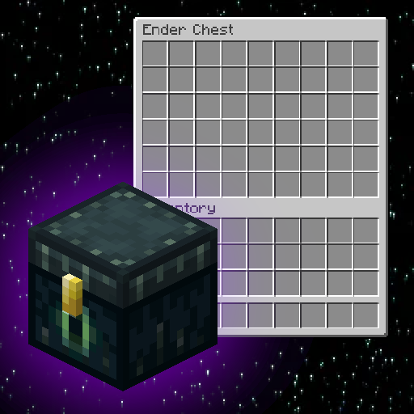

# LazyMC Double Ender Chest

Every player's ender chest has 54 slots (6 rows) instead of vanilla's 27 (3 rows) — same inventory everyone already has, just twice the size.

Two mixins: `EnderChestInventory` backing size, and the ender chest screen handler (`createGeneric9x3` → `createGeneric9x6`).

## Features

- 54 slots (6 rows) per ender chest
- Works for all players on a server — each player's ender chest inventory is independent
- No configuration, no commands

## Compatibility

| | |
|---|---|
| Minecraft | 1.21.11 |
| Loader | Fabric 0.19.3+ |
| Dependencies | None |
| Server/Client | Both |

## Install

1. Download the `.jar` from [Modrinth](https://modrinth.com/mod/lazymc-double-ender-chest) or [CurseForge](https://curseforge.com/minecraft/mc-mods/lazymc-double-ender-chest)
2. Drop into `mods/` folder
3. Done.

## License

MIT
